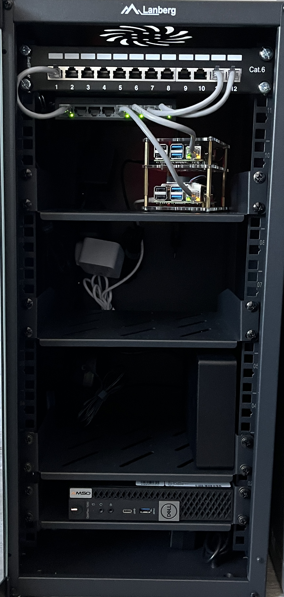

# Welcome to my Home Lab!

_⬆️ That's my home lab ⬆️_

## What's on it?

I'm running Proxmox VE as my main system, hosting both virtual machines and containers. The first VM runs TrueNAS Scale, which provides shared storage for my home and my Kubernetes cluster via iSCSI. The second VM is a Kubernetes master instance, managing a cluster that includes two Raspberry Pis. Additionally, I have two containers serving as DNS servers to block unwanted content.

### If you appreciate my work, you can support me by buying a [coffee](https://buycoffee.to/deejayadi).

## If you have more questions join my [Discord server](https://discord.gg/TWpnuKnjsX)
