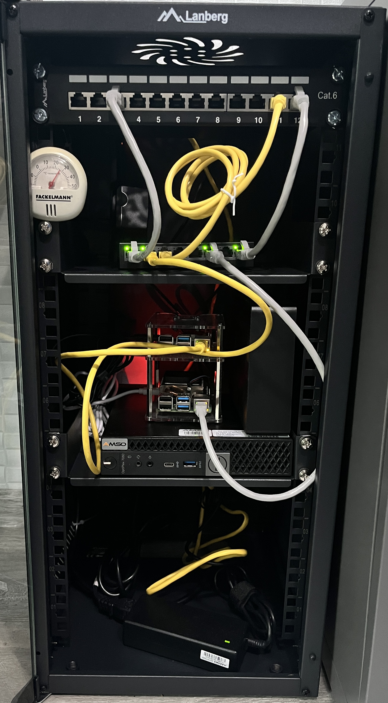

# Welcome to my Home Lab!

_⬆️ That's my home lab ⬆️_

## What's on it?

I'm running an LXD cluster with virtual machines and containers. I also run a K3S cluster hosting my [Discord bot](https://github.com/deejayadi/cyborg). Additionally, I have SAMBA, FTP, and Pi-Hole services running, along with other setups for learning and testing configurations.

## What's included in this cluster?

My cluster includes two Raspberry Pi B4 with 4GB of RAM each and a Dell OptiPlex 7060 Micro powered by an Intel i5-8500 processor and 8GB of RAM. I plan to upgrade the Dell OptiPlex to 32GB of RAM in the future.

If you appreciate my work, you can support me by buying a [coffee](https://buycoffee.to/deejayadi).

## If you have more questions join my [Discord server](https://discord.gg/TWpnuKnjsX)
